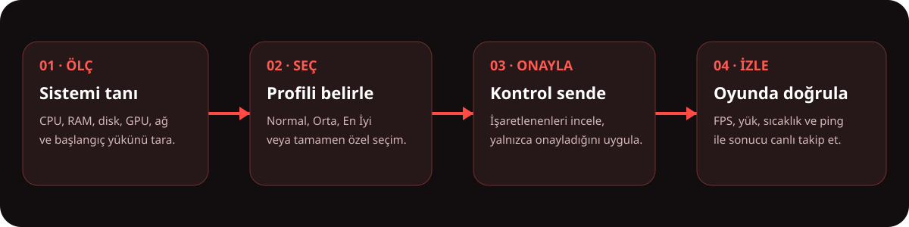
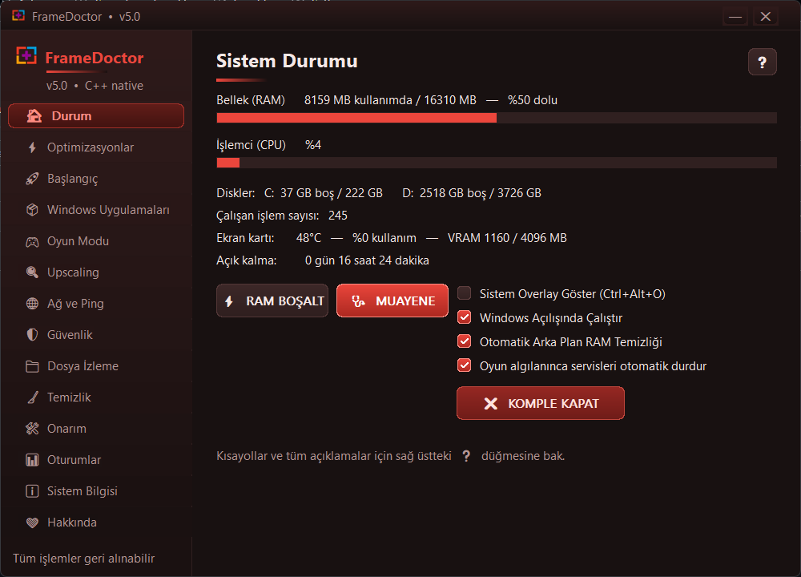
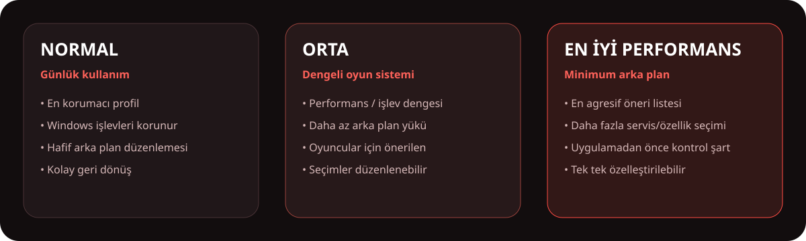
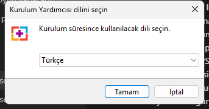

<div align="center">


# FrameDoctor v5.0

### Oyuncular için sistem sağlığı, performans yönetimi ve canlı oyun analizi

[](#sistem-gereksinimleri)
[](#teknik-yapı)
[](#indirme-ve-kurulum)
[](#dosya-bütünlüğü)

**FrameDoctor**, Windows’un dağınık performans ayarlarını tek bir yerde toplar; sistemini ölçer, seçenekleri anlaşılır profiller halinde sunar ve yalnızca sen onayladıktan sonra uygular. Oyun sırasında FPS, donanım yükü ve ağ durumunu görünür kılarak “neden drop yiyorum?” sorusuna ölçülebilir cevap vermeyi amaçlar.

[**⬇ FrameDoctor v5.0 Setup İndir**](https://github.com/Engin622/FrameDoctor/raw/main/FrameDoctor-Setup-v5.0.exe)

<sub>Ücretsiz dağıtım · Reklamsız · Hesap gerektirmez · Kaynak kod bu depoda yayımlanmaz</sub>

</div>

---

## İçindekiler

- [FrameDoctor ne yapar?](#framedoctor-ne-yapar)
- [Nasıl çalışır?](#nasıl-çalışır)
- [Uygulama ekranı](#uygulama-ekranı)
- [Bütün özellikler](#bütün-özellikler)
- [Performans profilleri](#performans-profilleri)
- [Oyun içi gösterge ve FPS ölçümü](#oyun-içi-gösterge-ve-fps-ölçümü)
- [Güvenlik ve gizlilik](#güvenlik-ve-gizlilik)
- [İndirme ve kurulum](#indirme-ve-kurulum)
- [Dosya bütünlüğü](#dosya-bütünlüğü)
- [Kısayollar](#kısayollar)
- [Sık sorulan sorular](#sık-sorulan-sorular)
- [Teknik yapı](#teknik-yapı)

## FrameDoctor ne yapar?

FrameDoctor bir “tek tıkla mucizevi FPS” programı değildir. Yeni donanım üretmez ve her bilgisayarda aynı sonucu garanti etmez. Yaptığı iş daha nettir:

1. Sistemin mevcut durumunu ölçer.
2. Oyun performansına etki edebilecek Windows ayarlarını ve arka plan yüklerini gösterir.
3. Normal, Orta ve En İyi Performans profilleri sunar.
4. Kullanıcının seçimleri kontrol etmesini bekler.
5. Onaylanan değişiklikleri uygular.
6. Oyun sırasında FPS, GPU, CPU, RAM ve ping verileriyle sonucu takip eder.
7. Sorun olduğunda geri alma ve Windows onarım araçları sağlar.

Amaç yalnızca ortalama FPS’yi yükseltmek değil; **FPS dalgalanmasını, gereksiz arka plan yükünü ve teşhis edilemeyen sistem sorunlarını azaltmaktır.**

## Nasıl çalışır?

<p align="center"></p>

FrameDoctor, bir profil seçildiğinde ayarları gizlice uygulamaz. Profil önce ilgili seçenekleri işaretler. Kullanıcı listeyi kontrol eder, istemediği maddeleri kaldırabilir ve yalnızca **Uygula** düğmesine bastığında işlem yapılır.

## Uygulama ekranı

<p align="center">
  
</p>

Ana ekranda RAM kullanımı, CPU yükü, disklerdeki boş alan, çalışan işlem sayısı, NVIDIA GPU sıcaklığı/kullanımı/VRAM bilgisi ve sistemin açık kalma süresi tek bakışta görülebilir.

Sol menüdeki bölümler görevlerine göre ayrılmıştır. Her bölümün sağ üstündeki **?** düğmesi, o ekrandaki seçenekleri ve olası etkilerini açıklar.

## Bütün özellikler

### 1. Sistem Durumu

- Anlık RAM kullanımı ve toplam bellek
- Anlık CPU yükü
- Sabit disk ve SSD boş alanları
- Çalışan işlem sayısı
- NVIDIA GPU sıcaklığı, kullanım oranı ve VRAM bilgisi
- Bilgisayarın açık kalma süresi
- Tek tıkla çalışma kümelerini boşaltan RAM aracı
- Genel sistem muayenesi
- Overlay, otomatik RAM temizliği ve otomatik oyun algılama kontrolleri

> CPU sıcaklığı Windows tarafından her anakartta güvenilir biçimde sunulmadığı için uydurma bir değer gösterilmez. Desteklenmeyen ölçüm “yok” kabul edilir.

### 2. Optimizasyonlar

- Windows Oyun Modu ve Game DVR tercihleri
- Güç planı ve güç tasarrufu davranışları
- Donanım hızlandırmalı GPU zamanlaması gibi desteklenen grafik seçenekleri
- Görsel efekt ve arka plan davranışı seçenekleri
- Disk uyku ve USB güç tasarrufu tercihleri
- Fare ivmesi gibi oyuncu giriş ayarları
- Üç hazır profil veya tamamen özel seçim
- Uygulanan ayarları geri alma

Her ayarın etkisi sistemden sisteme değişebilir. FrameDoctor bu yüzden seçenekleri kullanıcıya gösterir ve karar yetkisini kullanıcıda bırakır.

### 3. Başlangıç Yönetimi

- Windows ile başlayan uygulamaları listeler
- Seçilen başlangıç kaydını devre dışı bırakır
- Daha önce kapatılan kaydı tekrar açabilir
- Programın kendisini silmez; yalnızca otomatik çalışma kaydını yönetir
- Kritik Windows süreçleri oyun modu listesine alınmaz

### 4. Windows Uygulamaları

- Kurulu isteğe bağlı Windows uygulamalarını tarar
- Widget, Bing, Telefon Bağlantısı, Teams, Clipchamp ve benzeri paketleri ayrı ayrı gösterir
- Profil seçimine göre öneri oluşturur
- Kullanıcının işaretlemediği uygulamaya dokunmaz
- Kaldırma işleminden önce seçimin kontrol edilmesini bekler

OneDrive gibi bulut yedekleme araçları kaldırılmadan önce dosya eşitleme ihtiyacı ayrıca değerlendirilmelidir.

### 5. Oyun Modu

- Arka planda çalışan güvenli kapatma adaylarını listeler
- Anti-cheat ve kritik Windows işlemlerini koruma listesinde tutar
- Kullanıcı tarafından seçilen uygulamaları geçici olarak kapatabilir
- Oyun algılandığında seçili arka plan servislerini geçici durdurabilir
- Oyun sona erdiğinde veya Normal moda dönüldüğünde servisleri tekrar başlatır
- `Ctrl + Alt + G` ile hızlıca etkinleştirilebilir

FrameDoctor oyun dosyalarına kod enjekte etmez ve anti-cheat süreçlerini kapatmayı hedeflemez.

### 6. FrameScale Upscaling

- Pencereli çalışan bir oyunu seçer
- Görüntüyü GPU tabanlı büyütme penceresinde gösterir
- Keskinlik ayarı sunar
- Düşük iç çözünürlük kullanılarak GPU yükünün azaltılmasına yardımcı olabilir
- `F10` ile büyütme görünümünden çıkılır

FrameScale, DLSS değildir. Oyuna ait hareket vektörlerini kullanmaz ve yeni kare üretmez; görüntüyü büyütüp keskinleştiren bağımsız bir araçtır. Kazanç, oyunun GPU sınırlı olup olmamasına bağlıdır.

### 7. Ağ ve Ping

- Cloudflare, Google ve belirlenen hedeflere ping testi
- Aktif ağ bağdaştırıcılarını görüntüleme
- DNS seçenekleri arasında geçiş
- DNS’i tekrar Windows otomatik ayarına döndürme
- Oyun içi göstergede düzenli ping ölçümü

DNS değiştirmek oyun sunucusuna fiziksel mesafeyi azaltmaz. Genellikle yalnızca alan adı çözümleme süresine etki eder.

### 8. Güvenlik Görünümü

- Aktif TCP/UDP bağlantılarını işlem bazında listeler
- Yerel süreç, uzak IP, port ve bağlantı durumunu gösterir
- Ters DNS ile mümkün olduğunda alan adını çözer
- Çalıştırılabilir dosyanın dijital imzasını kontrol eder
- İmzasız, geçici klasörden çalışan veya sistem işlemini taklit eden süreçleri risk puanıyla işaretler
- Seçilen işlemin klasörünü veya VirusTotal arama sayfasını açabilir
- Hosts, proxy, DNS, Defender ve şüpheli başlangıç davranışları için kontrol sunar

Bu bölüm tam antivirüs yerine geçmez. Risk işareti “kesin zararlı” anlamına gelmez; kullanıcının incelemesi gereken bir davranışı belirtir.

### 9. Dosya İzleme

- Windows ETW dosya olayları üzerinden yeni dosya, silme ve yeniden adlandırma hareketlerini izler
- Olayı oluşturan işlemi ve hedef yolu gösterir
- `.exe`, `.dll`, `.bat`, `.cmd`, `.ps1`, `.vbs`, `.js`, `.scr`, `.lnk` gibi riskli türleri öne çıkarır
- Seçilen dosyanın tür imzasını, boyutunu ve ilk bölümünü inceleyebilir
- Metin dosyalarını okunabilir içerik, ikili dosyaları sınırlı hex görünümüyle sunar
- İzleyici kapatıldığında ETW oturumunu temiz biçimde sonlandırır

### 10. Temizlik

- Doğrulanmış kullanıcı Temp klasörünü tarar
- Windows Temp klasörünü tarar
- DirectX shader önbelleği seçeneği sunar
- Geri Dönüşüm Kutusu temizliğini ayrı onaya bırakır
- Kullanımda olan dosyaları zorla silmez
- Junction ve sembolik bağlantı hedeflerinin içine girmez
- Claude, Antigravity, VS Code ve Cursor gibi geliştirme/yapay zekâ araçlarının bilinen çalışma klasörlerini korumaya çalışır

Shader önbelleği temizlenirse oyunların ilk açılışında shader’lar yeniden oluşturulacağı için geçici takılmalar görülebilir.

### 11. Windows Onarım Araçları

- Sistem geri yükleme noktası oluşturma
- `SFC /scannow`
- DISM bileşen deposu onarımı
- Winsock, IP ve DNS önbelleği sıfırlama
- FrameDoctor optimizasyonlarını geri alma

SFC ve DISM işlemleri uzun sürebilir; işlem devam ederken bilgisayar kapatılmamalıdır.

### 12. Oyun Oturumları ve Sistem Bilgisi

- Algılanan oyun oturumlarının süresini kaydetme
- Ortalama FPS ve düşük FPS özeti
- GPU tepe sıcaklığı
- FPS düşüşlerinde CPU, GPU veya RAM darboğazı tahmini
- İşlemci, ekran kartı, RAM, anakart, Windows sürümü ve disk bilgileri
- Destek alırken paylaşılabilecek yerel sistem raporu

## Performans profilleri

<p align="center"></p>

| Profil | Kime uygun? | Yaklaşım |
|---|---|---|
| **Normal** | Günlük kullanım ve maksimum uyumluluk isteyenler | En az müdahale, Windows işlevlerini koruma |
| **Orta** | Oyun oynayan çoğu kullanıcı | Performans ve günlük kullanım dengesi |
| **En İyi Performans** | Bilgisayarını ağırlıklı olarak oyun için kullananlar | Daha agresif öneriler; uygulamadan önce liste mutlaka kontrol edilmeli |
| **Özel** | Ne istediğini bilen kullanıcılar | Her seçenek tek tek belirlenir |

Profil bir “zorunlu paket” değildir. Profil yalnızca önerilen seçenekleri işaretler; kullanıcı istediğini kaldırabilir veya ekleyebilir.

## Oyun içi gösterge ve FPS ölçümü

FrameDoctor FPS ölçümünde Windows’un gerçek zamanlı ETW sunum olaylarını dinler. DXGI ve desteklenen D3D9 `Present` olayları işlem bazında sayılır. Oyun dosyasına DLL enjekte edilmez.

Gösterge iki biçimde kullanılabilir:

- **Mini görünüm:** mümkün olduğunca az yer kaplayan FPS görünümü
- **Detaylı görünüm:** FPS, düşük değerler, CPU çekirdek yükleri, RAM, GPU, VRAM, sıcaklık, ping ve kısa süreli FPS grafiği

Ölçüm, oyun içindeki motor sayacıyla birebir aynı olmak zorunda değildir. Oyun sayacı simülasyon/render FPS’sini, FrameDoctor ise Windows’a sunulan kare olaylarını ölçer. Kare üretme, V-Sync, menü ekranı, pencere modu ve sunum yöntemi küçük farklara neden olabilir.

Overlay görünmiyorsa oyunu **Kenarlıksız Pencere / Borderless** modunda deneyin. Bazı özel tam ekran ve anti-cheat yapılandırmaları harici pencerelerin oyunun üstünde görünmesini engelleyebilir.

## Güvenlik ve gizlilik

### FrameDoctor ne gönderir?

FrameDoctor’un kendi reklam, kullanıcı hesabı veya ürün telemetrisi bulunmaz. Sistem raporu ve oyun oturumu kayıtları yerel bilgisayarda tutulur. VirusTotal seçeneği kullanılırsa yalnızca kullanıcı tarafından seçilen arama sayfası web tarayıcısında açılır; FrameDoctor dosyayı otomatik yüklemez.

### Ağ trafiğinin içeriğini okuyabilir mi?

Bağlantının hangi işlemden hangi IP/porta gittiğini gösterebilir. HTTPS/TLS ile şifrelenmiş trafiğin içeriğini açmaz. Bunu yapmak sisteme kök sertifika kuran bir araya girme proxy’si gerektirir ve güvenlik riski yaratacağı için FrameDoctor’da kullanılmaz.

### Sistem güvenliği

- Native C++ Release derlemesi
- ASLR ve yüksek entropili adresleme
- DEP/NX
- Control Flow Guard (CFG)
- CET uyumluluğu
- Tam yol doğrulamalı Windows sistem araçları
- Temp kök doğrulaması ve reparse-point koruması
- Dijital imza kontrolünde klasör adına göre sahte güven verilmemesi
- Kapanışta kalıcı izleyicilerin ve ETW oturumlarının temizlenmesi

### Dürüst sınır

Hiçbir masaüstü programı “kırılamaz” değildir. Native C++ kullanılması dnSpy gibi .NET odaklı araçlarla kaynak koda dönüştürmeyi engeller; ancak deneyimli kişiler Ghidra/IDA gibi araçlarla makine kodunu inceleyebilir. Bu nedenle FrameDoctor EXE içine parola, API anahtarı veya özel sertifika anahtarı gömmez.

## İndirme ve kurulum

### 1. İndir

[**FrameDoctor-Setup-v5.0.exe dosyasını indir**](https://github.com/Engin622/FrameDoctor/raw/main/FrameDoctor-Setup-v5.0.exe)

### 2. Kurulum dilini seç

<p align="center"></p>

Kurulum sihirbazı Türkçe ve İngilizce destekler. Önceki FrameDoctor kurulumu korumalı Program Files klasöründeyse mevcut konum otomatik algılanır ve sürüm üzerine güncellenir.

### 3. Kur

- Kurulum, güvenlik nedeniyle korumalı `Program Files\FrameDoctor` klasörünü kullanır.
- İsteğe bağlı masaüstü kısayolu oluşturulabilir.
- İsteğe bağlı Windows ile başlatma seçilebilir.
- Çalışan eski FrameDoctor kopyası varsa kurulum onu kapatmayı veya yeniden başlatmayı isteyebilir.

### 4. İlk çalıştırma

FrameDoctor sistem ayarlarını değiştiren özellikleri nedeniyle yönetici izni ister. İlk önce **Sistem Durumu** ve **Muayene** ekranlarını inceleyin; ardından Orta profille başlayıp önerileri kontrol etmek çoğu kullanıcı için uygun yaklaşımdır.

### Kaldırma

Windows **Ayarlar → Uygulamalar → Yüklü uygulamalar → FrameDoctor → Kaldır** yolunu kullanın. Kaldırmadan önce uygulamadaki **Tüm Optimizasyonları Geri Al** seçeneğini kullanmak tercih edilen ayarları Windows varsayılanına döndürür.

## Dosya bütünlüğü

Güncel kurulum paketinin SHA-256 değeri:

```text
CFAECCD445AA5FBCE5A04C2022BCAC2BE15BC60A99A5DE60D1B45085F3D5FA03  FrameDoctor-Setup-v5.0.exe
```

PowerShell ile doğrulama:

```powershell
Get-FileHash .\FrameDoctor-Setup-v5.0.exe -Algorithm SHA256
```

Çıktıdaki hash farklıysa dosyayı çalıştırmayın ve bu depodan tekrar indirin. SHA-256 değeri kaynak kodu veya gizli bilgi içermez; yalnızca dosyanın değiştirilmediğini doğrulayan parmak izidir.

> FrameDoctor şu anda ticari Authenticode sertifikasıyla imzalanmamıştır. Windows SmartScreen ilk çalıştırmada “Bilinmeyen yayıncı” uyarısı gösterebilir. SHA-256 doğrulaması dosya bütünlüğünü gösterir ancak ticari yayıncı kimliği doğrulamasının yerine geçmez.

## Kısayollar

| Kısayol | İşlev |
|---|---|
| `Ctrl + Alt + G` | Oyun Moduna geç |
| `Ctrl + Alt + N` | Normal moda dön |
| `Ctrl + Alt + O` | Sistem göstergesini aç/kapat veya görünümünü değiştir |
| `Ctrl + Alt + P` | Göstergenin ekran köşesini değiştir |
| `F10` | FrameScale görünümünden çık |

## Sistem gereksinimleri

- Windows 10 veya Windows 11
- 64-bit işlemci ve işletim sistemi
- Yönetici yetkisine sahip kullanıcı hesabı
- En az 4 GB RAM; oyun kullanımı için 8 GB ve üzeri önerilir
- FrameScale için DirectX 11 uyumlu ekran kartı
- Ayrıntılı GPU sıcaklığı/VRAM görünümü için NVIDIA sürücüsü ve `nvidia-smi`
- Ping, ters DNS ve çevrim içi aramalar için internet bağlantısı

## Sık sorulan sorular

<details>
<summary><strong>Gerçekten FPS artırır mı?</strong></summary>

Bilgisayar arka plan servisleri, başlangıç uygulamaları, yanlış güç planı veya RAM baskısı nedeniyle sınırlanıyorsa FPS kararlılığı ve düşük FPS değerleri iyileşebilir. Sistem zaten temizse ortalama FPS artışı küçük olabilir. Sonuç donanıma ve oyuna bağlıdır.
</details>

<details>
<summary><strong>Oyun dosyalarına müdahale ediyor mu?</strong></summary>

Hayır. FPS ölçümü Windows ETW olaylarını, FrameScale ise pencere yakalama/büyütme yaklaşımını kullanır. Oyuna DLL enjekte etmez ve oyun belleğini değiştirme amacı taşımaz.
</details>

<details>
<summary><strong>Ban riski var mı?</strong></summary>

FrameDoctor kritik anti-cheat süreçlerini kapatma listelerinden hariç tutar ve oyuna kod enjekte etmez. Yine de her rekabetçi oyunun kendi kullanım koşulları vardır; üçüncü taraf overlay kullanımına ilişkin oyunun kuralları ayrıca kontrol edilmelidir.
</details>

<details>
<summary><strong>Windows Defender’ı kapatıyor mu?</strong></summary>

Hayır. FrameDoctor’un amacı güvenlik ürünlerini kapatmak değildir. Defender durumu güvenlik kontrolünde incelenebilir.
</details>

<details>
<summary><strong>Temp temizliği yapay zekâ/editör verilerimi siler mi?</strong></summary>

Temizlik doğrulanmış Temp kökleriyle sınırlandırılmıştır; reparse-point hedefleri takip edilmez ve bilinen Claude, Antigravity, VS Code ve Cursor klasörleri korunmaya çalışılır. Yine de önemli projeler ve konuşma verileri için düzenli yedek alınması önerilir.
</details>

<details>
<summary><strong>Neden CPU sıcaklığı görünmüyor?</strong></summary>

Windows’un ACPI/WMI sıcaklık sağlayıcısı birçok anakartta yanlış değer verir veya hiç cevap vermez. FrameDoctor güvenilir olmayan bir değeri gerçekmiş gibi göstermek yerine desteklenmiyor kabul eder. GPU sıcaklığı NVIDIA destekli sistemlerde gösterilir.
</details>

<details>
<summary><strong>SHA-256 değerinin açık paylaşılması tehlikeli mi?</strong></summary>

Hayır. Hash tek yönlü bir dosya parmak izidir. Kaynak kodu, parola veya özel anahtar içermez; dosyanın değiştirilip değiştirilmediğini kontrol etmek için yayımlanır.
</details>

<details>
<summary><strong>Değişiklikleri geri alabilir miyim?</strong></summary>

Optimizasyon seçeneklerinin geri alma işlemleri bulunur ve Onarım bölümündeki toplu geri alma aracı kullanılabilir. Kaldırılmış Store uygulamalarının yeniden kurulması Microsoft Store gerektirebilir.
</details>

## Teknik yapı

- Uygulama: Native Win32 C++
- Grafik arayüz: Özel çizimli Windows kontrolleri
- FPS ölçümü: Windows ETW, DXGI/D3D9 Present olayları
- Dosya izleme: Windows Kernel File ETW sağlayıcısı
- Ağ görünümü: Windows IP Helper ve Winsock API’leri
- Paketleme: Inno Setup 6
- Mimari: Windows x64
- Dağıtım: Derlenmiş Setup paketi; kaynak kod bu depoda yayımlanmaz

## Sürüm ve destek

Bu depo FrameDoctor’un resmî dağıtım kanalıdır. Sorun bildirirken aşağıdaki bilgileri eklemek teşhisi hızlandırır:

- Windows sürümü
- İşlemci, ekran kartı ve RAM
- Sorunun gerçekleştiği FrameDoctor bölümü
- Varsa hata mesajının ekran görüntüsü
- Oyun adı ve pencere modu
- Sorunun tekrar edilme adımları

Gizlilik için rapor paylaşmadan önce kullanıcı adı, yerel dosya yolu veya IP gibi kişisel olabilecek alanları kontrol edin.

---

<div align="center">

### FrameDoctor

Geliştirici: **Engin** · Sürüm **5.0** · 2026

Copyright © 2026 Engin. Tüm hakları saklıdır.

Bu depo uygulamanın dağıtım kanalıdır; kaynak kod deposu değildir.

</div>
